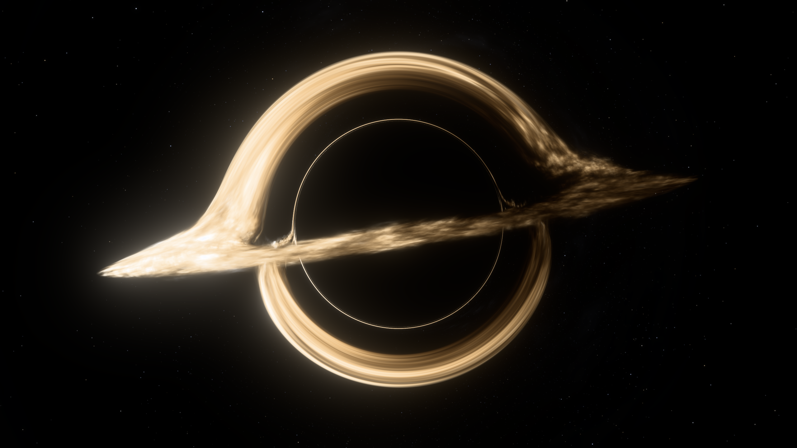
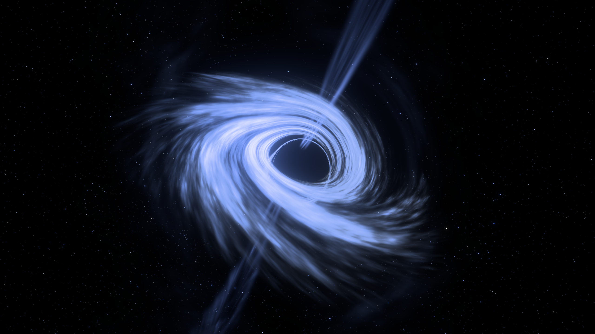

<p align="center">
  
</p>

# Nullray

**Follow light around a rotating black hole.**

A browser observatory built with TypeScript and native WebGPU. Trace light through Kerr–Newman spacetime, explore the observer's view, and make photographs of lensed accretion disks and relativistic jets.

[Get started](#get-started) · [Documentation](docs/README.md) · [Physical scope](docs/validation/coverage.md) · [MIT license](LICENSE)



_Classic disk — 2560 × 1440, 64 samples per pixel, exported directly from Nullray._

<details>
<summary>Blue accretion flow</summary>



_Blue accretion flow — 2560 × 1440, 64 samples per pixel. Both photographs use the built-in presets at a fixed epoch and SDR Display P3 output._

</details>

## Explore

- **Light and matter.** Gravitational lensing, Doppler and gravitational frequency shifts, thermal disks, prescribed synchrotron jets, and a catalogue-based sky.
- **Different observers.** Change spin, charge and physical motion; compare static, freely falling and custom-velocity views. Camera navigation is independent of observer velocity.
- **Beyond the exterior.** Inspect ray paths and explore interior blocks, negative-radius domains and naked singularities. Try vacuum linear polarization or the monochromatic plasma-refraction preview.
- **Photographs and saved views.** Pause, refine, export a PNG, or share the scene as a link. Rendering runs on a dedicated worker.

Nullray is an optical prototype. Matter is prescribed rather than fluid-simulated; complete maximal-extension coverage and critical-image accuracy remain open. The [coverage ledger](docs/validation/coverage.md) records implemented behavior and validation gaps.

## Get started

Use **Node.js 26+**, **pnpm**, and a recent browser with a compatible WebGPU adapter. The renderer requires subgroups, texture formats tier 2 and WGSL read/write storage textures; see the [full browser requirements](docs/engineering/development.md#native-browser-baseline).

```sh
git clone https://github.com/romeoahmed/nullray.git
cd nullray
pnpm install --frozen-lockfile
pnpm dev
```

Open the local URL printed by Vite. Choose a preset under **Views**, drag to orbit, and scroll to zoom. With the canvas focused, **Space** pauses and **H** hides the controls. Pause settles to 16 samples; **Photograph → Save photograph** exports a 64-sample still.

Native device pixels are the default. Lower scales and **Auto** are available for playback; photographs always use native resolution.

## Development

```sh
pnpm build       # Static checks and production bundle
pnpm test        # CPU tests and physical references
pnpm test:gpu    # Browser GPU checks
pnpm test:ui     # Browser interaction and worker lifetime
```

See [development](docs/engineering/development.md) for browser installation and all commands, [architecture](docs/engineering/architecture.md) for code ownership, and [validation](docs/validation/methods.md) for numerical checks and benchmarks. Bug reports are most useful with a shared view, browser/GPU details and reproduction steps.

## Credits

Created by [Romeo Ahmed](https://github.com/romeoahmed). Nullray builds on published relativity and radiative-transfer work cited alongside the [physical models](docs/README.md).

| Contribution                     | Source                                                                                                                           |
| -------------------------------- | -------------------------------------------------------------------------------------------------------------------------------- |
| Star catalogue                   | David Nash / Astronexus — [HYG Database 4.4](https://codeberg.org/astronexus/hyg)                                                |
| Colour-matching data             | International Commission on Illumination — [CIE 1931 observer](https://doi.org/10.25039/CIE.DS.xvudnb9b)                         |
| Tone-mapping foundation          | The Khronos Group — [PBR Neutral](https://github.com/KhronosGroup/ToneMapping/tree/main/PBR_Neutral), adapted highlight shoulder |
| Scattering-atmosphere values     | N. A. Silant’ev, G. A. Alekseeva and Yu. K. Ananjevskaja — [Milne atmosphere table](https://doi.org/10.1093/mnras/stz123)        |
| Visual and rendering inspiration | baopinshui — [NPGS](https://github.com/baopinshui/NPGS); no code or assets adapted                                               |

## License

Original code and documentation are licensed under [MIT](LICENSE). Third-party data and adapted components retain their own licenses; [NOTICE.md](NOTICE.md) records attribution, modifications and data provenance, with bundled license text in [licenses/](licenses/). The example photographs are shared under [CC BY-SA 4.0](https://creativecommons.org/licenses/by-sa/4.0/), with attribution in [NOTICE.md](NOTICE.md#example-photographs).
