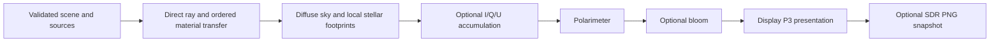

# Architecture and runtime contracts

The main thread owns interaction; a dedicated WebGPU worker owns rendering and source time. [Development](development.md) defines commands and platform requirements.

## Repository map

| Location             | Owner and entry points                                                                                                   |
| -------------------- | ------------------------------------------------------------------------------------------------------------------------ |
| `src/scene/`         | Atomic construction in `scene.ts` / `preparation.ts`; camera, navigation, appearance, actions and schema-1 serialization |
| `src/physics/`       | Pure metric/observer/geodesic calculations, disk and spectral preparation, catalogue tree                                |
| `src/gpu/optics/`    | Pipeline assembly, source/target ownership, explicit frame ABI                                                           |
| `src/gpu/sources/`   | Catalogue upload, noise-volume and spectral-cube generation                                                              |
| `src/gpu/imaging/`   | Sampling, Stokes analysis, history, coverage, bloom and PNG export                                                       |
| `src/gpu/wgsl/`      | Explicit geometric, source, transfer and image-pass equations                                                            |
| `src/runtime/`       | Client/worker protocol, revision handling and scheduling                                                                 |
| `src/ui/`            | DOM, controls, gestures, bookmarks, audio and topology inspection                                                        |
| `src/data/`          | Attributed CIE, Milne and HYG data; provenance in [NOTICE](../../NOTICE.md)                                              |
| `tests/reference/`   | Binary64 reference calculations, outside production imports                                                              |
| `tests/regressions/` | Concrete reproduced failures and their provenance                                                                        |
| `benchmarks/`        | CPU preparation, optical frames, initialization and renderer sequences                                                   |

Domain code has no GPU handles, DOM, persistence, clocks or random state. Readonly does not freeze typed arrays; document writes to caller-owned buffers.

## Scene construction and reuse

[createScene](../../src/scene/scene.ts) validates coupled physical inputs atomically. [prepareScene](../../src/scene/preparation.ts) builds the observer endpoint, tetrad, block, chart-time offset and disk profile. Failure rejects the action and restores accepted UI values.

Quantize geometry/source boundaries before preparation. Free fall integrates by proper time. Camera/source edits reuse the endpoint; unchanged spacetime/radii reuse the disk profile. There is no global physical cache.

[Session](../../src/scene/session.ts) separates saved views from playback/resolution. [Schema-1 views](../../src/scene/view.ts) retain physical, camera, source, detector/display and epoch inputs; derived state, GPU history and playback/resolution choices are excluded. Restore pauses at the saved epoch. Shared [presentation choices](../../src/scene/presentation.ts) keep decoding, controls and actions consistent.

## Worker protocol and lifetime

The [client](../../src/runtime/client.ts) assigns increasing revisions and coalesces updates on animation frames. Snapshots contain presentation/runtime state; omitted scene/appearance fields retain their previous values. The [worker](../../src/runtime/worker/main.ts) reconstructs changed inputs.

Only one frame completion is outstanding. New intent may arrive meanwhile; renderer identity and revision checks reject stale frames, inspections and exports. Worker phases are idle, starting, ready, failed and disposed. Superseded initialization releases its context before retry; recoverable device failure reuses the canvas, while a crashed worker requires a fresh client/canvas.

Client states are active, failed and disposed. A crash terminates ownership and pending intent. Failed/disposed clients ignore work and cannot retry. Scoped initialization releases a worker if canvas transfer or the initial message fails.

Canvas transfer is permanent. [mountApp](../../src/ui/app.ts) replaces the element before transfer. Disposable stacks and abort signals release partial/replaced owners; GPU handles never cross messages.

Playback advances ten geometric time units per wall-clock second, with ticks capped at 0.25 seconds. Pause, visibility and epoch restoration reset its clock baseline. This animation clock is independent of mass calibration and observer proper time.

## Resolution and scheduling

ResizeObserver supplies native device-pixel dimensions. Fixed scales 1, 0.75, 0.5 and 0.25 scale both axes with integer flooring and a one-pixel minimum. Device texture limits may reduce the raster uniformly; fixed modes never adapt to timing.

For native requested dimensions $W,H$ and Auto budget $B$, the playback scale is

$$
s_{\rm auto}=\min\left(1,\sqrt{\frac{B}{\max(1,WH)}}\right).
$$

Auto starts at $B=640\times360$. Every eight eligible completed frames, [resolution.ts](../../src/runtime/worker/resolution.ts) averages render/submission-completion wall time $t$ in ms. Within 24–42 ms keep the budget; otherwise

$$
B_{\rm next}=\operatorname{clamp}\left(
P\operatorname{clamp}(33/t,0.75,1.25),\ 160\times90,\ 1920\times1080\right),
$$

$P$ is actual rendered pixels. Invalid timing leaves $B$ unchanged. Mode, motion, visibility and size changes discard partial windows. Fixed modes do not train Auto; this wall-clock feedback is not GPU timestamp timing.

Auto pauses at native resolution; fixed modes pause at their chosen scale. Paused images stop after 16 direct samples; Photograph takes 64 native samples. Diagnostics normally use one sample. Hidden/zero-size surfaces suspend work; completed unchanged images do not redraw.

## Rendering pipeline

[Optics](../../src/gpu/optics/engine.ts) owns pipelines, source resources and raster-dependent targets. [frame.ts](../../src/gpu/optics/frame.ts) packs the ABI declared in [frame.wgsl](../../src/gpu/wgsl/imaging/frame.wgsl); [WGSL layout](shaders.md#parallel-execution-and-memory) owns its details.

The path pass writes foreground I/Q/U, destination metadata, asymptotic direction/frequency and transmission. The celestial pass adds unpolarized background for eligible vacuum endpoints. [Image formation](../numerics/image-formation.md) defines filtering and validity.

| Resource                                                | Storage and lifetime                                                     |
| ------------------------------------------------------- | ------------------------------------------------------------------------ |
| Per-sample radiance, Q/U, transmission, composed output | f16 textures, recreated on raster change                                 |
| Asymptotic direction/frequency                          | f32 texture, recreated on raster change                                  |
| Destination metadata                                    | signed integer texture; never color-interpolated                         |
| Three photographic histories                            | f32 read/write textures; output images are f16                           |
| Noise, sky cube/mips, catalogue and spectral tables     | Optical-owner lifetime; changed disk/jet inputs trigger specific uploads |
| Bloom pyramid                                           | Size-dependent; filtered result reused while detector image is unchanged |
| Inspection/export staging                               | Temporary buffers retained through readback, then released               |

I/Q/U share sample/reset state. Detector edits rerun polarimetry; exposure, white balance and bloom reuse the physical image. HDR reconfigures presentation. Jet spectra are rebuilt only when density, field, mass, electron cutoff or observing frequency changes.

## Persistence, export and inspection

URL fragments are decoded as `unknown`, limited to 4096 characters and validated atomically. Local library `nullray.views.v1` holds up to 100 unique names of 1–80 characters; corrupt data reports an error without overwriting it. Clipboard, files, media and object URLs remain UI-owned.

Export snapshots the completed 64-sample image, presents it with SDR mapping and encodes an 8-bit Display P3 PNG. It contains neither HDR/Stokes data nor missing-weight metadata or a view sidecar. Check readback capacity separately from texture dimensions.

Inspection runs the production integrator at an unjittered direction and returns accepted states, chart times, blocks and crossing count. The topology panel clips distant radii and brackets between samples; it is not a proper-distance embedding, causal diagram or pixel beam.
